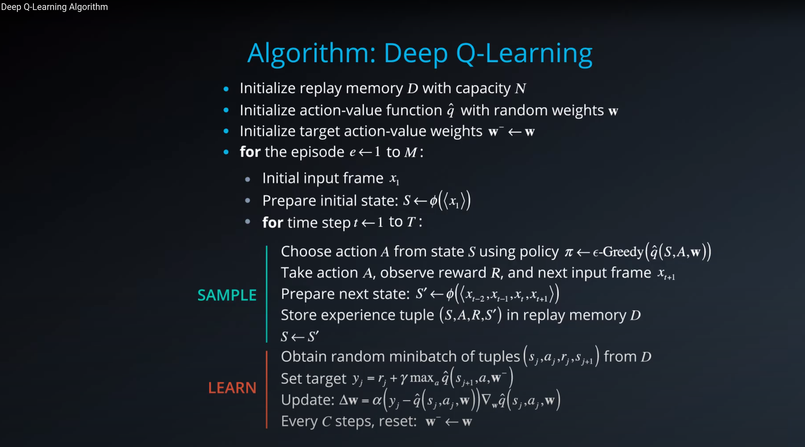
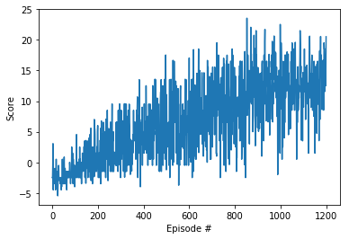

## Project1: Navigation

### Goal of this project:
The goal is to train an agent that can navigate a simple gridworld environment collecting yellow bananas each giving a reward of +1 while avoiding blue ones who has a reward of -1 and maximize its total reward per episode.

### Definition of Solved:
The environment is solved if the agent's average total rewards over 100 consequitive episodes is >=+13.

### Method used:
To solve this environment, I trained and used a vanilla Deep Q-Network (DQN) agent.
I have also tweaked the reward signal a bit, to avoid an issue I noticed that the agent sometimes gets stuck doing nothing but moving right and left in front of a blue banana!

My tweaked reward penalizes taking an action that is not collecting a banana, so, the rewards received from the environment are +1 for collecting a yellow banana, -1 for a blue one and a decaying by episode length nevative reward for transitions where the reward is originally 0 in the environment, which I call idel_reward.

The goal behind this is to urge the agent to collect yellow bananas quickly espeically in the beginning of the episode and not "slack around" and grab the nearest yellow bananas.

The decay factor of the penality is to ensure that the agent still is encouraged to take more steps when there are no more nearby yellow bananas, thus it can travel further in the environment, since near the end of the episode the agent is has most likely consumed all the yellow bananas in his local area and might need to move further to get more.

That said, my concept of the idel_reward adds two additional hyperparameters to tweak, the `idel_reward_start` and the `idle_reward_decay`.

I start by a penalty of `idel_reward = -0.5`, decay it each step by `idel_reward*0.8` which taking a limit to inf converges to a 0 penalty.

This has sped up the solution to ~1k episodes!

### Q values in a brief:
For each state, for each action in it, the agent learns to estimate a value indicating the total outcome if the agent happens to be in that state and executes that action then acts rationally onwards to the end of the episode/task.

### [About Deep Q-Learning](https://deepmind.com/research/publications/playing-atari-deep-reinforcement-learning):
Deep Q-Learning belongs to the deep reinforcment learning toolbox of, off-policy, Value based methods, where the agent learns by interactions with the environment to estimate aa state action value for each state action pair it encounters.

After training, the agent can exploit its estimations of the state action value pairs to select the action with the largest Q values on each state it lands on.




`figure 1. Deep reinforcement learning nano degree description of the DQN algorithm`

### Project files:
`Navigation.ipynb` the notebook driving the instantiation of the environment, the agent and training of the agent's model, it is following closely the udacity DRL nano degree class's implementation with a few tweaks e.g. a custom reward signal plus adaptation to the Navigation environment.

`Navigation.html` the same notebook saved in .html format after running it

`play_trained_agent.ipynb` a notebook for trying a trained model

`play_trained_agent.ipynb` the same notebook saved in .html format after running it

`model.pt` a trained model by the `Navigation.ipynb` notebook

`replay_buffer.py` the replay buffer implementation, exactly the same as the nano degree class' implementation

`dqn_agent.py` a vanilla DQN agent implementation following closely the ones from the udacity DRL nano degree class with a few tweaks

`model.py` a 1 hidden layer network used as the deep model for the local and target networks used in the agent following closely the ones from the udacity DRL nano degree class with a few tweaks

### Hyperparameters:

BUFFER_SIZE = int(1e5)   replay buffer size

BATCH_SIZE = 512         minibatch size

GAMMA = 0.99             discount factor

TAU = 1e-3               for soft update of target parameters

LR = 0.001               learning rate 

UPDATE_EVERY = 20        how often to update the target network

FC1_UNITS = 128 the number of the DQN hidden layer neurons

idle_reward_start = -0.5   the initial custom reward penalty for not picking a banana 

idle_reward_decay = 0.8    the decay of the pnealty


### Training progress:



Episode 100	Average Score: -2.13
Episode 200	Average Score: 0.044
Episode 300	Average Score: 2.05
Episode 400	Average Score: 3.91
Episode 500	Average Score: 5.63
Episode 600	Average Score: 6.06
Episode 700	Average Score: 7.52
Episode 800	Average Score: 9.38
Episode 900	Average Score: 10.29
Episode 1000 Average Score: 12.26
Episode 1100 Average Score: 12.18
Episode 1200 Average Score: 12.90
Episode 1201 Average Score: 13.01
Environment solved in 1101 episodes!	Average Score: 13.01
### Future improvements:
Confidently, next target is to step up from the vanilla DQN and try out extensions of DQN mentioned in DeepMinds' paper [Rainbow: Combining Improvements in Deep Reinforcement Learning](https://arxiv.org/pdf/1710.02298.pdf)

### Briefly a few:
#### Using a Prioritized replay buffer: 
Instead of uniformally sampling from our replay buffer, we could prioritize samples from episodes with better total rewards

#### [Noisy Networks for Exploration](https://arxiv.org/pdf/1706.10295.pdf): 
Tweaking the agent's model for a more efficient exploration by embedding noise in the network's weights

#### N-Step DQN:
Learning to Predict by the Methods of Temporal Differences, by Richard Sutton (Sutton, 1988)
Unrolling the bellman equation to N-steps look-ahead for a better approximation of the Q values, which should speed up the correction of the computed Q values per state action.

#### [Double DQN](https://arxiv.org/pdf/1509.06461.pdf):
The vanilla DQN are found to overestimate the Q values, the next state's q values in the bellman equation were computed using our target network
The Authors of the paper in the link suggested instead choosing the actions for the next state using the local network instead of the target and then taking their Q values using the target network.

### Or even trying a different family of methods:
e.g. Policy gradient methods in which the agent's model learns the policy directly, by learning to predict a distribution over actions and sampling the action to use from it for each state.

#### Splitting the Buffer filling and the training into two different processes for training speed


```python

```
